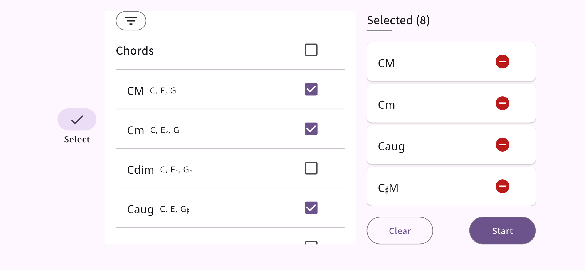
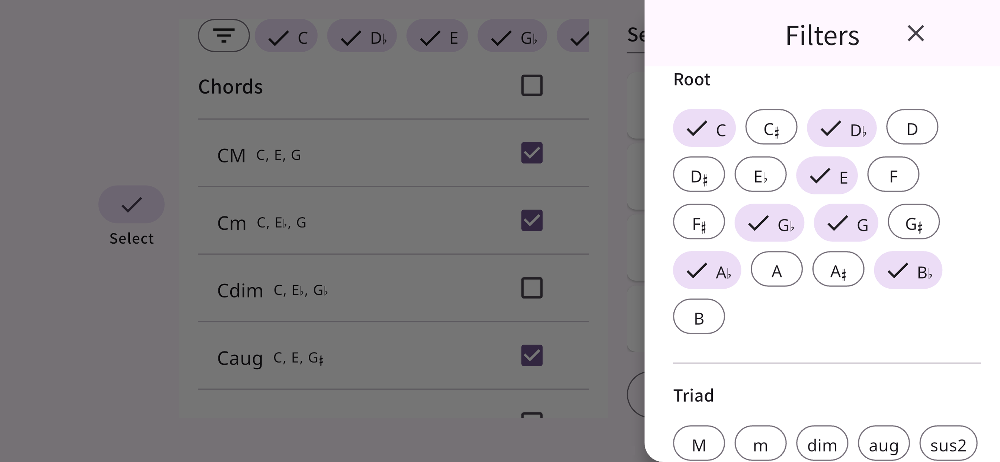
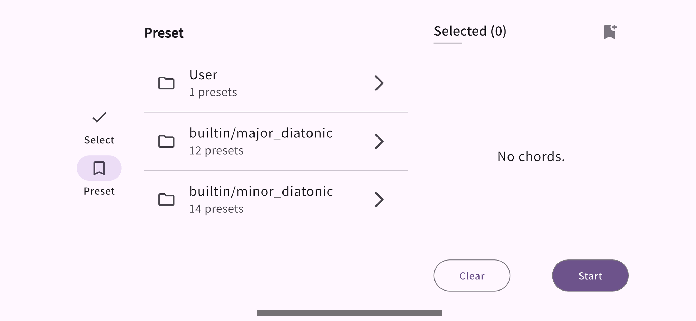
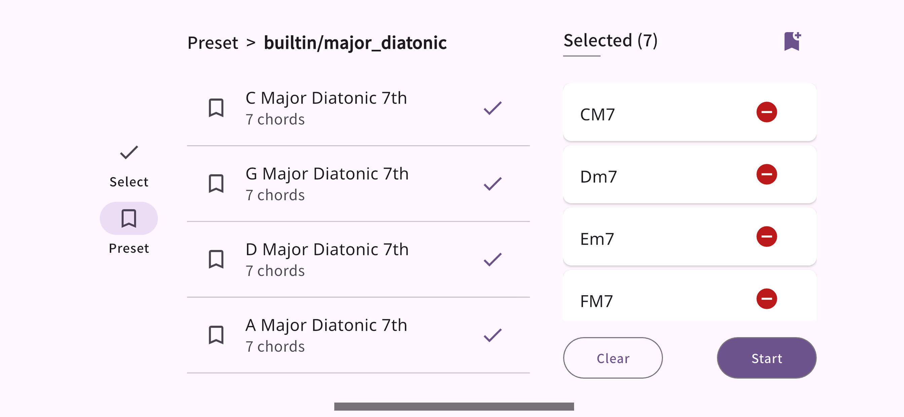
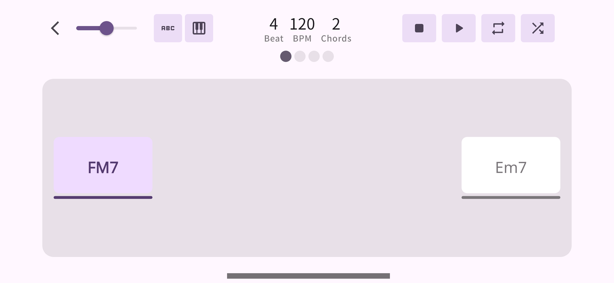
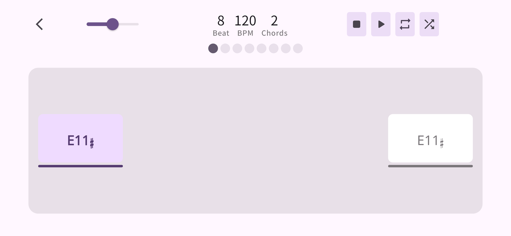

# 🎶 Chordra (C2B chord)

**Master your weakest chords.**  
Level up your chord skills with smart, focused practice.
Chordra helps you play better by showing you random chord progressions with a metronome.

#### 🔗 Download & Support

- [Feedback & Support](https://mokzas.github.io/chordra-support)
- [App Store](https://apps.apple.com/kr/app/chordra/id6744913508)
- [Play Store](https://play.google.com/store/apps/details?id=kr.mokzas.c2b_chord)

## ✨ Features

#### 🎯 **Choose the chords you want to master** 

Pick the chords you find tricky or want to practice more often. Use filters like root, triad, 7th, extension, or alteration to find exactly what you need.

#### 🎲 **Practice with surprise and variety**  

Chordra shows random chords from your selection, so you never get too comfortable — perfect for real improvement.

#### ⏯ **Play, Pause, or Stop**  

Start your session with a metronome, pause to take a breath, or stop to restart from the beginning. Simple and smooth.

#### 🔁 **Loop your favorite progression**  

Activate loop mode to repeat the current chord progression and build muscle memory faster.

#### 🛠 **Customize your practice**  

Set how many beats each chord lasts, adjust the BPM, and choose how many chords you want to see per session.

## 📱 Screenshots










## 📦 Changelog

### [v1.0.0] - 2025-05-19

#### The first release

- Select a chord to practice, and a random progression will be generated.
- Set BPM, time signature, and practice with a metronome.
- Like the current progression? Use Repeat Mode to loop it.
- Use the Shuffle feature to generate a new random progression on the current screen.

<br>

---

<br>

# 👨🏻‍💻 For developer

## 🚀 Version info for build
    • Flutter version 3.29.3 on channel stable at /Users/cerik/development/flutter
    • Upstream repository https://github.com/flutter/flutter.git
    • Framework revision ea121f8859 (10 days ago), 2025-04-11 19:10:07 +0000
    • Engine revision cf56914b32
    • Dart version 3.7.2
    • DevTools version 2.42.3

## Git-flow

| Category | Description |
| --- | --- |
| Feat | 기능 추가, 제거, 변경.  |
| Fix | 버그 수정 |
| Design | CSS 등 사용자 UI 디자인 변경 (기능 변경 없음) |
| !HOTFIX | 급하게 치명적인 버그를 고쳐야하는 경우 |
| Style | 코드 포맷 변경, 세미 콜론 누락, 코드 수정이 없는 경우 |
| Refactor | 기능 및 UI 변경이 없는 프로덕션 코드 리팩토링 |
| Comment | 필요한 주석 추가 및 변경 |
| Docs | 문서 수정 |
| Test | 테스트 코드, 리팩토링 테스트 코드 추가, Production Code(실제로 사용하는 코드) 변경 없음 |
| Chore | 빌드 업무 수정, 패키지 매니저 수정, 패키지 관리자 구성 등 업데이트, Production Code 변경 없음 |
| Rename | 파일 혹은 폴더명을 수정하거나 옮기는 작업만인 경우 |
| Remove | 파일을 삭제하는 작업만 수행한 경우 |
| Report-Bug | 오류동작 리포트 |
| Report-Advance | 개선요청 리포트 |

### Issue Title

`<category>: <description>`

예) Feat: 메트로놈 기능에 3/4 박자 추가  *// UI, 기능 추가*

예) Feat: 셔플 버튼 제거  *// UI, 기능 제거*

예) Design: 코드 트레이닝 화면 반응형으로 변경  *// UI 변경*

예) Design: 랜딩 페이지 백그라운드 이미지 변경  *// UI 변경*

예) Design: 셔플 버튼 형태 라운드로 변경  *// UI 변경*

예) !HOTFIX: 유료 기능 결제 회원 정보 저장되지 않는 문제  *// 아주 급함*

## Branch

### 기본 브랜치

main    ———————>  릴리즈 브랜치

develop  ——————>  개발 메인 브랜치 (Default branch)

design-system  ———>  디자인시스템 브랜치 (Figma에서 push)

### 작업 브랜치

사용가능 문자: 영문  숫자  .  /  -  _

`<category>/<description>-<issue no>`

- \<category>, \<description>: 깃헙 이슈 제목 내용을 영어로 작성.
- \<issue no>: 깃헙 이슈 번호
- 깃헙 이슈 없는 경우 \<issue no> 없이 \<category>, \<description>만 작성. 위의 이슈 작성 방법대로.

예) feat/add-shuffle-rhythm-metronome-24

예) test/test-signup-state-change

예) hotfix/missing-user-paid-feature-info-35

> 커밋 메시지에 이슈 번호를 붙이면 깃헙에서 issue 상세페이지에 해당 커밋이 연관 커밋으로 표시됩니다.
> 

## Commit

```
<category>: <description> (#<issue no>)

<body>

<footer>
```

- \<category>, \<description>: 깃헙 이슈 제목에서 가져옴
- \<issue no>: 깃헙 이슈 번호
- \<body>: 세부 내용. ‘-’ 사용하여 나열. 첫줄 작성후 한 줄 띄울 것 (optional)
- \<footer>: 관련된 커밋 등 있는 경우 작성 (optional)

예)

```
Feat: 메트로놈 기능에 3/4 박자 추가 (#24)

- 박자 선택 옵션 버튼 추가
- 4/4, 3/4, 6/8 버튼 추가
```

예)

```
!HOTFIX: 유료 기능 결제 회원 정보 저장되지 않는 문제 (#35)

- 박자 선택 옵션 버튼 추가
- 4/4, 3/4, 6/8 버튼 추가

유사한 이슈: #21
참고한 이슈: #25
...
```

## CI/CD

Github Actions 사용하여 build 테스트, build 결과물 저장

### Trigger

- push: main
- pull_request: main