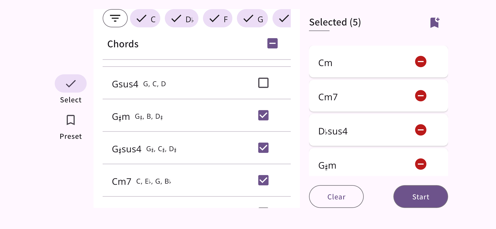
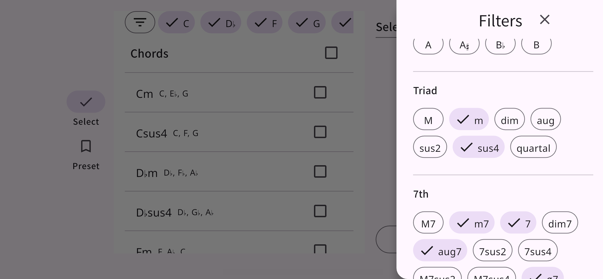
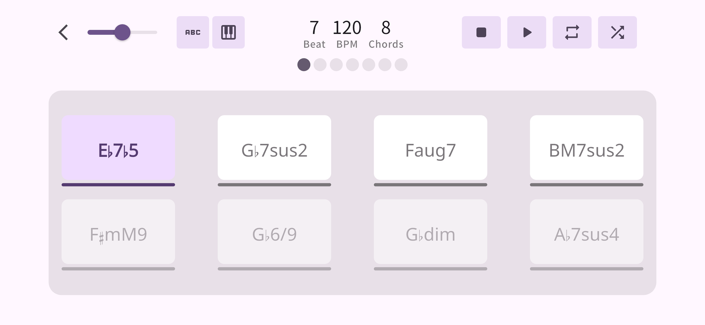

# 🎶 Chordra (C2B chord)

**Master your weakest chords.**  
Level up your chord skills with smart, focused practice.
Chordra helps you play better by showing you random chord progressions with a metronome.

#### 🔗 Download & Support

- [Feedback & Support](https://mokzas.github.io/chordra-support)
- [App Store](https://apps.apple.com/kr/app/chordra/id6744913508)
- [Play Store](https://play.google.com/store/apps/details?id=kr.mokzas.c2b_chord)

## ✨ Features

#### 🎯 **Choose the chords you want to master** 

Pick the chords you find tricky or want to practice more often. Use filters like root, triad, 7th, extension, or alteration to find exactly what you need.

#### 🎲 **Practice with surprise and variety**  

Chordra shows random chords from your selection, so you never get too comfortable — perfect for real improvement.

#### ⏯ **Play, Pause, or Stop**  

Start your session with a metronome, pause to take a breath, or stop to restart from the beginning. Simple and smooth.

#### 🔁 **Loop your favorite progression**  

Activate loop mode to repeat the current chord progression and build muscle memory faster.

#### 🛠 **Customize your practice**  

Set how many beats each chord lasts, adjust the BPM, and choose how many chords you want to see per session.

## 📱 Screenshots

 
 

---

 

## 📦 Changelog

### [v1.0.0] - 2025-05-19

#### The first release

- Select a chord to practice, and a random progression will be generated.
- Set BPM, time signature, and practice with a metronome.
- Like the current progression? Use Repeat Mode to loop it.
- Use the Shuffle feature to generate a new random progression on the current screen.

