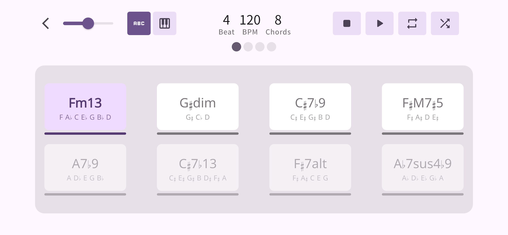
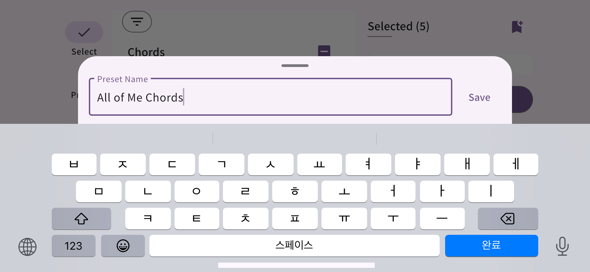

# 🎶 Chordra (C2B chord)

### Know a chord in one song, but can't play it in another?
Master your weakest chords. Prepare for any situation with random chord progression practice.

#### 🔗 Download & Support

- [Feedback & Support](https://mokzas.github.io/chordra-support)
- [App Store](https://apps.apple.com/kr/app/chordra/id6744913508)
- [Play Store](https://play.google.com/store/apps/details?id=kr.mokzas.c2b_chord)

## ✨ Features
Ever thought **"I definitely know how to play this chord..."**?

The reason why a chord that felt natural in one song suddenly feels awkward in another is because you didn't truly master the chord itself—you just memorized the finger patterns.

Chordra mixes your selected chords randomly, so you can build **real chord skills** instead of just pattern memorization.

#### 🎯 **Find the chords you need** 

Choose the chords you struggle with most. 

Quickly select the chords you want to work on with smart filters for root, triad, 7th, extensions, and alt/add.

#### 🎲 **Save your favorites**  

Create your own chord presets for tomorrow’s practice.

Or start with built-in major and minor diatonic sets.

#### ⏯ **Learn on the go**  

No piano around? Use the virtual piano quiz mode to test your chord tone knowledge—perfect for the bus, subway, or anywhere.

#### 🔁 **Loop Mode for Tough Progressions**  

Loop and repeat any chord progression until it feels natural and effortless.

#### 🛠 **Practice Settings**  

Customize beats per chord, BPM, and number of chords displayed on screen.

 

---

 

## 📦 Changelog

### [v1.1.0] - 2025-09-23

- Preset feature added: Save and load selected chords as presets
- Built-in presets: Collections of major and minor diatonic chords
- Quiz mode added: A chord-tone guessing game with a virtual piano
- Chord tones display: Now shows chord tones beneath each chord

### [v1.0.1] - 2025-09-06

- Fixed issues with the "Select All" checkbox state and the filtering algorithm
- Changed the behavior so that practice starts after a countdown when playback begins

### [v1.0.0] - 2025-05-19

#### The first release

- Select a chord to practice, and a random progression will be generated.
- Set BPM, time signature, and practice with a metronome.
- Like the current progression? Use Repeat Mode to loop it.
- Use the Shuffle feature to generate a new random progression on the current screen.

